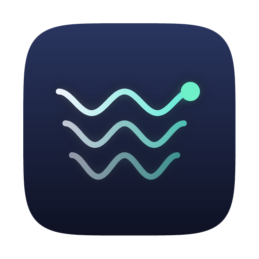

<div align="center">



# Quiet Vibe Status

**A quiet place in the notch for your coding agents.**

A native macOS menu bar app that watches every AI coding agent you have running, shows what each one is doing from the Mac's notch, and lets you approve permissions and answer questions without leaving the window you're in. Part of the [Quiet Apps](https://github.com/quietapps) family.

[](https://www.apple.com/macos/)
[](https://swift.org)
[](https://developer.apple.com/xcode/swiftui/)
[](LICENSE)
[](https://github.com/quietapps/QuietVibeStatus/releases)
[](https://github.com/quietapps/QuietVibeStatus/releases)
[](https://github.com/quietapps/QuietVibeStatus/stargazers)

[Install](#install) · [Features](#features) · [Usage](#usage) · [Build from source](#build-from-source) · [FAQ](#faq)

</div>

---

## Why

You've got Claude Code running in one tab, Codex in another, maybe a subagent buried three panes
deep in tmux — and half of them are just sitting there waiting on a permission prompt you haven't
noticed yet.

Quiet Vibe Status lives in your Mac's notch. Every agent session gets a card — project, branch,
what it's doing right now, which terminal it's in — and the panel opens the moment one of them
needs you. Approve, deny, answer, or review a plan without ever leaving the window you're already
in. Click a card and the exact terminal tab comes forward. No cloud. No account. No telemetry.

## Features

**Current release:** version **1.0.3**, build **4** — see [CHANGELOG](CHANGELOG.md) for per-build notes

### Monitor

- **Live session cards** — project, worktree branch, the prompt you typed, current activity, model, host terminal, and token cost, all driven by real agent hook events
- **Group by project** — collect sessions from the same directory under one heading
- **Session history** — finished sessions logged with duration, model, tokens, and an estimated cost, with a seven-day summary
- **Subagents nest** under their parent session
- **Smart sort** — anything blocking on you floats to the top
- **Session recap** from the agent's final message once a card goes idle
- **Directory and prompt filters**, with presets for the helper sessions agents spawn in the background
- **Sessions survive a restart** — cards for agents still running come back when the app relaunches
- **Dead sessions retire themselves** — a closed tab never sends `SessionEnd`, so cards are checked against the agent's own process

### Approve

- **Blocking permission cards** — the actual command in front of you, with Allow, Always allow, Deny, and a hand-back-to-terminal escape hatch
- **Scoped "Always allow"** — approving `npm test` doesn't approve all of `npm`
- **Plan review** — Markdown rendering, approve, approve with auto-accepted edits, or reject with written feedback
- **Paginated question wizard** for structured multi-question prompts, including free-text answers
- Quitting the app mid-approval releases the agent instead of hanging it
- **Approvals hand themselves back** after a configurable wait, so a card you never saw cannot block an agent all day

### Jump

- Click a card and the exact tab, split pane, or IDE window comes forward
- Precise focus for iTerm2 and Terminal.app by session id, Ghostty by process tree, VS Code, Cursor, and Windsurf by workspace
- tmux panes are selected before the window is raised

### Stay quiet

- Eight assignable events with synthesized 8-bit sounds, envelope-ramped so square waves don't click on good headphones
- Custom WAV, MP3, and AIFF import
- Quiet hours, including ranges that cross midnight
- Quiet scenes for Focus mode, a locked screen, and screen recording or sharing

### Track quota

- Optional status line bridge reads Claude's five-hour and seven-day limits, chaining in front of any status line you already had and passing your own output through untouched
- Codex quota read from its own state files
- Used or remaining display, with an Auto / Claude / Codex provider picker — Auto shows both at once
- Per-session token cost, estimated at published list prices (a weight, not a bill — subscription plans don't charge per token)

### Native macOS feel

- Menu bar accessory — no Dock icon, idle at near-zero CPU
- 100% Swift — SwiftUI panel, AppKit notch geometry
- No external dependencies — Apple frameworks only
- **Completely private** — no data collected, no accounts, no network access, no telemetry

## Install

> **Note:** Quiet Vibe Status is not code-signed with an Apple Developer ID. macOS Gatekeeper will warn on first launch. The steps below work around it automatically.

### Homebrew (recommended)

```bash
brew tap quietapps/quietvibestatus
brew install --cask quietvibestatus
```

The cask strips the macOS quarantine attribute on install so Gatekeeper does not block launch. The tap is at [quietapps/homebrew-quietvibestatus](https://github.com/quietapps/homebrew-quietvibestatus).

### Direct download

1. Grab the latest `QuietVibeStatus-*.zip` from [Releases](https://github.com/quietapps/QuietVibeStatus/releases/latest)
2. Unzip → drag **Quiet Vibe Status.app** into `/Applications`
3. Strip the quarantine attribute (or right-click → Open once):

```bash
xattr -cr "/Applications/Quiet Vibe Status.app"
```

4. Launch Quiet Vibe Status — the panel settles under your notch
5. Follow the onboarding flow to connect whichever agents it finds

### If the app doesn't open (Gatekeeper blocked it)

macOS silently blocks unsigned binaries on first launch. Fix it once with any of these:

**Option A — Right-click open (no Terminal needed)**
1. Open Finder → `/Applications`
2. Right-click **Quiet Vibe Status.app** → **Open**
3. Click **Open** in the warning dialog
4. macOS remembers your choice for every future launch

**Option B — Terminal**
```bash
xattr -cr "/Applications/Quiet Vibe Status.app"
```

**Option C — System Settings**
1. Try to launch the app — macOS shows a blocked notification
2. Open **System Settings → Privacy & Security**
3. Scroll to the message about Quiet Vibe Status
4. Click **Open Anyway**

## Updating

### Homebrew

```bash
brew update
brew upgrade --cask quietvibestatus
```

### Direct download

Download the newer zip from [Releases](https://github.com/quietapps/QuietVibeStatus/releases), drag the new **Quiet Vibe Status.app** over the old one in `/Applications`, then run:

```bash
xattr -cr "/Applications/Quiet Vibe Status.app"
```

Your settings and installed hooks are unaffected by app updates.

## Uninstalling

Use **Settings → Integrations → Uninstall** first — it removes every agent hook and the status line bridge before you delete the app.

### Homebrew

```bash
# Remove the app and its preferences (via the cask's zap stanza)
brew uninstall --cask --zap quietvibestatus

# Drop the tap
brew untap quietapps/quietvibestatus
```

### Direct download

```bash
# Move the app to Trash
rm -rf "/Applications/Quiet Vibe Status.app"

# Remove settings and the bridge's support folder
defaults delete app.quiet.QuietVibeStatus 2>/dev/null
rm -rf ~/Library/Preferences/app.quiet.QuietVibeStatus.plist \
       ~/Library/Caches/app.quiet.QuietVibeStatus \
       ~/Library/Saved\ Application\ State/app.quiet.QuietVibeStatus.savedState \
       ~/.quietvibestatus
```

## Usage

| Action | How |
|---|---|
| Open the panel | Hover the notch pill, or click it |
| Approve / deny a request | Panel → **Allow** / **Always allow** / **Deny** |
| Answer a structured question | Panel → pick an option or type your own |
| Review a plan | Panel → **Approve** / **Approve with edits** / **Reject with feedback** |
| Jump to a session | Click its card |
| Connect an agent | Settings → **Integrations** → toggle the agent on |
| Set quiet hours / scenes | Settings → **Sound** |
| Check quota | Settings → **Usage** |
| Quit | Menu bar → **Quit Quiet Vibe Status** |

## How it connects to agents

Each supported CLI has a hook system. Quiet Vibe Status installs one small shell script,
`~/.quietvibestatus/bin/quiet-vibe-bridge`, and points those hooks at it.

```
agent hook  →  quiet-vibe-bridge  →  ~/.quietvibestatus/run/bridge.sock  →  app
                                  ←──────── decision JSON ─────────────←
```

The bridge forwards the hook payload plus the terminal environment it can see — `TERM_PROGRAM`,
`ITERM_SESSION_ID`, `TMUX_PANE`, and friends — which is what makes precise click-to-jump possible.
For blocking events like permission requests, the socket connection stays open while you decide;
that connection *is* the agent's wait.

**The bridge can never break an agent.** If the socket is missing, the app is quit, or anything at
all goes wrong, the script exits 0 with empty output and the agent falls back to its normal terminal
prompt.

### Config files it touches

| Agent | File |
|---|---|
| Claude Code | `~/.claude/settings.json` |
| Codex | `~/.codex/hooks.json` |
| Gemini CLI | `~/.gemini/settings.json` |
| Cursor Agent | `~/.cursor/hooks.json` |

Hooks are **merged, never clobbered**. Your own hooks and any other tool's hooks are left exactly as
they were, JSON-with-comments is parsed correctly, symlinked dotfiles are written through rather
than replaced, and a `.qvs-backup` copy is kept next to each file. Settings → Integrations →
Uninstall removes every trace.

If you also run another notch agent monitor, both sets of hooks will fire and you'll see duplicate
cards. Settings → Integrations detects the common ones — including an uninstalled rival whose hooks
were never cleaned up — and removes their entries on request, leaving the rest of the file alone.

## Permissions

None required beyond what each agent's own hook system already needs. Quiet Vibe Status uses
AppleScript only to focus the terminal tab your agent is running in — macOS may prompt for
Automation access the first time a jump fires.

No network access at all — the app makes zero network calls.

## How it works

| Requirement | Implementation |
|---|---|
| Notch panel | Custom `NSPanel` sized to hardware notch geometry, with a compact fallback bar on notch-less displays |
| Session state | In-memory store fed by the bridge's Unix socket server; nothing is persisted to disk except an optional debug log |
| Blocking approvals | The bridge holds the hook's socket connection open until you answer, so the agent's own process blocks on your decision |
| Terminal jump | Per-terminal focus strategies — session id, process tree, or workspace lookup — behind a common router |
| Hook install | JSON-with-comments-aware merge into each CLI's config, symlink-safe, backed up, and reapplied on every launch |
| Sound | Synthesized 8-bit waveforms, envelope-ramped, shut down when idle so the app never holds the output device |
| No Dock icon | Menu bar accessory (`.accessory` activation policy) |

## Build from source

### Requirements

- macOS 14.0 (Sonoma) or later
- Xcode 15.0 or later
- [XcodeGen](https://github.com/yonaskolb/XcodeGen)
- Python 3 with `numpy` and `Pillow` (app icon generation only)

No paid Apple Developer account required — local builds use ad-hoc signing (`CODE_SIGN_IDENTITY=-`).

### Steps

```bash
brew install xcodegen
git clone https://github.com/quietapps/QuietVibeStatus.git
cd QuietVibeStatus
xcodegen generate
open QuietVibeStatus.xcodeproj
```

Press **⌘R** in Xcode. The panel settles under your notch.

Or from the command line:

```bash
xcodebuild -project QuietVibeStatus.xcodeproj -scheme QuietVibeStatus -configuration Release build
```

The built app lands in Xcode's DerivedData; copy it to `/Applications`.

To regenerate the app icon after editing `Tools/generate_icon.py`:

```bash
python3 Tools/generate_icon.py
```

### Project layout

```
QuietVibeStatus/
├── App/            entry point, preferences, theme, logging
├── Notch/          the panel — NSPanel, notch geometry, collapsed pill, expanded panel
├── Sessions/       session model, store, cards
├── Bridge/         Unix socket server, hook envelope, router
├── Integrations/   hook installer + one adapter per agent
├── Approvals/      approval cards, plan review, question wizard, pending registry
├── Jump/           per-terminal focus strategies
├── Sound/          8-bit synthesis, quiet scenes
├── Usage/          quota tracking, status line bridge
├── Settings/       ten settings panes
├── Onboarding/     first-run flow
└── Resources/      asset catalog, bridge scripts
Tools/              icon generator
```

No external dependencies — Apple frameworks only (SwiftUI, AppKit, AppleScript).

## Configuration

All settings are in **Settings** (menu bar icon → **Settings…**), across ten panes: **General**
(hover, dwell, auto-hide, cleanup, session restore, approval timeout), **Integrations** (per-agent
hook toggles, competing-monitor cleanup, repair, uninstall), **Notifications** (completion behavior,
quiet scenes, directory and prompt filters), **Display** (clean or detailed pill, panel size, card
fields, project grouping, token cost, notch alignment), **Sound**, **Usage**, **History** (finished
sessions and cost summary), **Shortcuts**, **Labs**, **About**.

Reset to defaults:

```bash
defaults delete app.quiet.QuietVibeStatus
```

This resets preferences only. Installed agent hooks are untouched — use Settings → Integrations →
Uninstall to remove those.

### A note on ⌘Y and ⌘N

Inside the panel these always approve and deny. There is also a toggle in Shortcuts that makes them
system-wide while a request is pending. It ships **off**, deliberately: a system-wide hot key takes
⌘Y away from every other app for the duration, and a stray press approves a request you never read.

## FAQ

**Does Quiet Vibe Status send my session data anywhere?**
No. Zero network calls. Session data lives in memory. Two files are the exception, both local and
readable only by your account: the optional `~/.quietvibestatus/debug.log`, and
`~/.quietvibestatus/state/sessions.json`, which holds live session cards so they survive a restart
of the app, and `~/.quietvibestatus/state/history.json`, the finished-session log. Turn off
**Settings → General → Restore sessions on launch** or **Settings → History → Keep session history**
to delete each file and stop it being written.

**Can it break my agent's hooks?**
The bridge is designed to fail safe. If the socket is missing, the app is quit, or anything goes
wrong, the hook script exits 0 with empty output and the agent falls back to its normal terminal
prompt.

**Will it clobber my existing hooks?**
No. Hooks are merged, never replaced. Your own hooks and any other tool's hooks in the same config
file are left exactly as they were, and a backup is kept next to each file it touches.

**Which agents does it support?**
Claude Code (wired to fourteen hook events), Codex, Gemini CLI, and Cursor Agent through a shared
adapter.

**Which terminals can it jump to?**
iTerm2, Terminal.app, Warp, and Ghostty, plus VS Code, Cursor, and Windsurf by workspace, and tmux
panes selected before the window is raised.

**I run another notch agent monitor too — now I see duplicate cards.**
Both sets of hooks are firing. Turn one integration off in Settings.

**Why is the system-wide ⌘Y/⌘N off by default?**
It would take those keys from every other app while a request is pending, and a stray press would
approve something you never read. Turn it on in Shortcuts if you want it anyway.

**How do I quit?**
Click the menu bar icon → **Quit Quiet Vibe Status**.

## Status

Verified working end to end: the notch panel, live session cards from real Claude Code hooks,
blocking permission approvals, and the guarantee that quitting the app mid-approval releases the
agent cleanly.

Built but not yet exercised against a live agent: the Codex, Gemini, and Cursor adapters, terminal
jump, plan review, the question wizard, the sound engine, usage tracking, and quiet scenes.

## Feedback

Bug reports and ideas: [GitHub Issues](https://github.com/quietapps/QuietVibeStatus/issues).

## License

[MIT](LICENSE) © Quiet Apps

This is an independent implementation. It talks to each CLI vendor's own public hook API and
contains no code or assets from any other application.

---

<div align="center">
If Quiet Vibe Status keeps you out of fourteen terminal tabs, drop a ⭐ on the repo.
</div>
